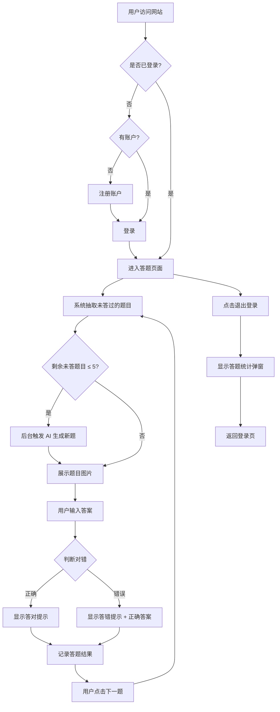
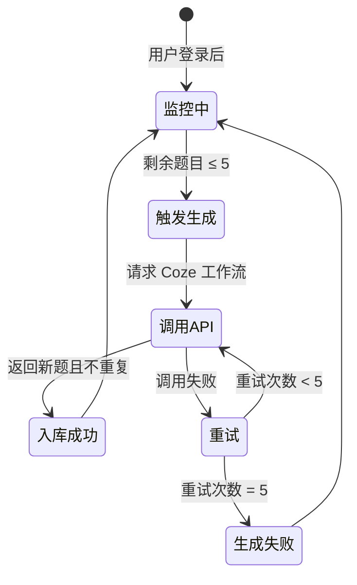

# 产品需求文档：看图猜词小游戏 - V1.0

## 1. 综述 (Overview)

### 1.1 项目背景与核心问题

本项目是一个网页版「看图猜词」小游戏。用户通过查看图片，猜测图片所表达的词语，系统判断对错并给予反馈。

**核心问题**：为用户提供一个轻松有趣的看图猜词游戏体验，支持持续答题且题库可自动扩充。

**技术架构**：前后端分离，两个独立项目
- **后端**：账户体系 + 数据库 + Coze API 集成
- **前端**：登录注册页 + 答题页 + 统计弹窗 + 耗尽提示页

### 1.2 核心业务流程 / 用户旅程地图

1. **阶段一：账户入口** - 用户注册或登录系统
2. **阶段二：答题游戏（核心循环）** - 用户看图猜词，获得即时反馈
3. **阶段三：AI 预生成题目** - 题库不足时自动调用 AI 生成新题
4. **阶段四：答题统计** - 用户退出时查看本次答题表现

### 1.3 Mermaid 图（流程/状态/时序）

#### 1.3.1 用户操作流（核心流程图）



#### 1.3.2 AI 生题状态机



---

## 2. 用户故事详述 (User Stories)

### 阶段一：账户入口

---

#### **US-01: 老用户登录**

* **价值陈述 (Value Statement)**:
    * **作为** 已注册用户
    * **我希望** 输入邮箱和密码快速登录
    * **以便于** 继续我的答题游戏

* **业务规则与逻辑 (Business Logic)**:
    1. **前置条件**: 用户已有账户（邮箱已注册）
    2. **操作流程 (Happy Path)**:
        - 用户输入邮箱 + 密码
        - 点击「登录/注册」按钮
        - 系统验证邮箱存在且密码正确
        - 登录成功，跳转答题页面
    3. **异常处理 (Error Handling)**:
        - 邮箱格式不正确 → 提示"请输入有效的邮箱地址"
        - 密码错误 → 提示"密码错误，请重试"

* **验收标准 (Acceptance Criteria)**:
    * **场景1: 登录成功**
        * **GIVEN** 用户已注册邮箱 test@example.com，密码 123456
        * **WHEN** 输入正确的邮箱和密码并点击登录
        * **THEN** 跳转到答题页面
    * **场景2: 密码错误**
        * **GIVEN** 用户已注册邮箱 test@example.com
        * **WHEN** 输入错误密码并点击登录
        * **THEN** 显示"密码错误，请重试"，停留在登录页

* **页面布局线框图 (ASCII Wireframe)**:

```text
+------------------------------------------+
|            看图猜词小游戏                  |
+------------------------------------------+
|                                          |
|              [LOGO/标题图]                |
|                                          |
|  +------------------------------------+  |
|  |  邮箱                               |  |
|  +------------------------------------+  |
|                                          |
|  +------------------------------------+  |
|  |  密码                               |  |
|  +------------------------------------+  |
|                                          |
|  [ ] 记住我                              |
|                                          |
|  +------------------------------------+  |
|  |            登录 / 注册               |  |
|  +------------------------------------+  |
|                                          |
+------------------------------------------+
```

---

#### **US-02: 新用户注册并登录**

* **价值陈述 (Value Statement)**:
    * **作为** 新用户
    * **我希望** 通过简单的注册流程创建账户
    * **以便于** 开始玩看图猜词游戏

* **业务规则与逻辑 (Business Logic)**:
    1. **前置条件**: 用户邮箱未注册
    2. **操作流程 (Happy Path)**:
        - 用户输入邮箱 + 密码，点击「登录/注册」
        - 系统检测邮箱未注册，显示提示"检测到您是新用户，请确认密码完成注册"
        - 展开「确认密码」输入框
        - 用户输入确认密码，点击「注册并登录」
        - 系统验证两次密码一致，创建账户并自动登录
        - 跳转答题页面
    3. **异常处理 (Error Handling)**:
        - 邮箱格式不正确 → 提示"请输入有效的邮箱地址"
        - 密码少于 6 位 → 提示"密码至少需要 6 位"
        - 两次密码不一致 → 提示"两次密码不一致，请重新输入"

* **验收标准 (Acceptance Criteria)**:
    * **场景1: 注册成功**
        * **GIVEN** 邮箱 new@example.com 未注册
        * **WHEN** 输入邮箱、密码、确认密码（一致且≥6位）并提交
        * **THEN** 创建账户，自动登录，跳转答题页面
    * **场景2: 两次密码不一致**
        * **GIVEN** 用户处于新用户注册状态
        * **WHEN** 两次输入的密码不一致并提交
        * **THEN** 显示"两次密码不一致，请重新输入"，停留在当前页

* **页面布局线框图 (ASCII Wireframe)**:

```text
+------------------------------------------+
|            看图猜词小游戏                  |
+------------------------------------------+
|                                          |
|              [LOGO/标题图]                |
|                                          |
|  +------------------------------------+  |
|  |  邮箱（已填，可改）                   |  |
|  +------------------------------------+  |
|                                          |
|  +------------------------------------+  |
|  |  密码                               |  |
|  +------------------------------------+  |
|                                          |
|  ⚠️ 检测到您是新用户，请确认密码完成注册   |
|                                          |
|  +------------------------------------+  |
|  |  确认密码                            |  |
|  +------------------------------------+  |
|                                          |
|  [ ] 记住我                              |
|                                          |
|  +------------------------------------+  |
|  |              注册并登录              |  |
|  +------------------------------------+  |
|                                          |
+------------------------------------------+
```

---

### 阶段二：答题游戏（核心循环）

---

#### **US-03: 用户答题**

* **价值陈述 (Value Statement)**:
    * **作为** 已登录用户
    * **我希望** 看图猜词并获得即时反馈
    * **以便于** 享受游戏乐趣并测试自己的猜词能力

* **业务规则与逻辑 (Business Logic)**:
    1. **前置条件**: 用户已登录，题库中存在该用户未答过的题目
    2. **操作流程 (Happy Path)**:
        - 系统抽取一道该用户未答过的题目
        - 展示题目图片
        - 用户在输入框输入答案，点击「提交答案」
        - 系统进行模糊匹配（大小写不敏感，包含即可）
        - 答对 → 显示"🎉 恭喜您答对了！"
        - 答错 → 显示"❌ 正确答案是：XXX"
        - 用户点击「下一题」继续答题
    3. **异常处理 (Error Handling)**:
        - 用户提交空答案 → 提示"请输入答案"
        - 该用户无剩余题目 → 见 US-06（题库耗尽提示）

* **答案匹配规则**:
    - 大小写不敏感："Apple" 和 "apple" 视为相同
    - 包含即可：正确答案是"苹果"，用户输入"红苹果"也算对

* **验收标准 (Acceptance Criteria)**:
    * **场景1: 答对**
        * **GIVEN** 题目正确答案是"苹果"
        * **WHEN** 用户输入"红苹果"并提交
        * **THEN** 显示"🎉 恭喜您答对了！"，记录答对
    * **场景2: 答错**
        * **GIVEN** 题目正确答案是"苹果"
        * **WHEN** 用户输入"香蕉"并提交
        * **THEN** 显示"❌ 正确答案是：苹果"，记录答错
    * **场景3: 空答案**
        * **GIVEN** 用户在答题页面
        * **WHEN** 未输入任何内容点击提交
        * **THEN** 提示"请输入答案"，不进行判断

* **页面布局线框图 (ASCII Wireframe)**:

**答题状态（正常答题中）：**

```text
+------------------------------------------+
|  看图猜词      [退出登录]                 |
+------------------------------------------+
|                                          |
|  +------------------------------------+  |
|  |                                    |  |
|  |                                    |  |
|  |           [题目图片]                |  |
|  |                                    |  |
|  |                                    |  |
|  +------------------------------------+  |
|                                          |
|  +------------------------------------+  |
|  |  请输入你的答案...                   |  |
|  +------------------------------------+  |
|                                          |
|  +------------------------------------+  |
|  |              提交答案               |  |
|  +------------------------------------+  |
|                                          |
+------------------------------------------+
```

**答对反馈：**

```text
+------------------------------------------+
|  看图猜词      [退出登录]                 |
+------------------------------------------+
|                                          |
|  +------------------------------------+  |
|  |                                    |  |
|  |           [题目图片]                |  |
|  |                                    |  |
|  +------------------------------------+  |
|                                          |
|  +------------------------------------+  |
|  |                                    |  |
|  |     🎉 恭喜您答对了！ 🎉            |  |
|  |                                    |  |
|  +------------------------------------+  |
|                                          |
|  +------------------------------------+  |
|  |              下一题                 |  |
|  +------------------------------------+  |
|                                          |
+------------------------------------------+
```

**答错反馈：**

```text
+------------------------------------------+
|  看图猜词      [退出登录]                 |
+------------------------------------------+
|                                          |
|  +------------------------------------+  |
|  |                                    |  |
|  |           [题目图片]                |  |
|  |                                    |  |
|  +------------------------------------+  |
|                                          |
|  +------------------------------------+  |
|  |                                    |  |
|  |     ❌ 正确答案是：苹果              |  |
|  |                                    |  |
|  +------------------------------------+  |
|                                          |
|  +------------------------------------+  |
|  |              下一题                 |  |
|  +------------------------------------+  |
|                                          |
+------------------------------------------+
```

---

#### **US-04: 退出时展示答题统计**

* **价值陈述 (Value Statement)**:
    * **作为** 已登录用户
    * **我希望** 在退出时看到本次答题统计
    * **以便于** 了解自己的答题表现

* **业务规则与逻辑 (Business Logic)**:
    1. **前置条件**: 用户已登录并进行过答题
    2. **操作流程 (Happy Path)**:
        - 用户点击「退出登录」或关闭网页
        - 弹出统计弹窗，显示：答对数、答错数、正确率
        - 用户点击「确认退出」完成退出
    3. **异常处理 (Error Handling)**:
        - 用户未答过任何题 → 不弹窗，直接退出

* **验收标准 (Acceptance Criteria)**:
    * **场景1: 正常退出**
        * **GIVEN** 用户本次答对 12 题，答错 3 题
        * **WHEN** 点击「退出登录」
        * **THEN** 弹窗显示"答对：12 题，答错：3 题，正确率：80%"
    * **场景2: 未答题退出**
        * **GIVEN** 用户登录后未答任何题
        * **WHEN** 点击「退出登录」
        * **THEN** 直接退出，不弹窗

* **页面布局线框图 (ASCII Wireframe)**:

```text
+------------------------------------------+
|                                          |
|  +------------------------------------+  |
|  |         本次答题统计                 |  |
|  |  --------------------------------   |  |
|  |                                    |  |
|  |   ✅ 答对：12 题                    |  |
|  |   ❌ 答错：3 题                     |  |
|  |   📊 正确率：80%                    |  |
|  |                                    |  |
|  |  +------------------------------+  |  |
|  |  |           确认退出            |  |  |
|  |  +------------------------------+  |  |
|  +------------------------------------+  |
|                                          |
+------------------------------------------+
```

---

### 阶段三：AI 预生成题目

---

#### **US-05: AI 预生成题目**

* **价值陈述 (Value Statement)**:
    * **作为** 系统
    * **我希望** 在用户剩余题目不足时提前生成新题
    * **以便于** 用户答题不中断，体验流畅

* **业务规则与逻辑 (Business Logic)**:
    1. **触发条件**: 用户剩余未答题目 ≤ 5 道
    2. **操作流程 (Happy Path)**:
        - 后台调用 Coze API 工作流
        - 获取返回的 5 道题目（图片 + 答案）
        - 检查答案是否与题库重复（答案相同视为重复）
        - 不重复的题目入库
    3. **异常处理 (Error Handling)**:
        - API 调用失败 → 静默重试，最多 5 次
        - 重试 5 次仍失败 → 不影响用户当前答题，等下次触发再试

* **去重规则**:
    - 以答案为准，答案相同则视为重复，不入库

* **验收标准 (Acceptance Criteria)**:
    * **场景1: 正常生成**
        * **GIVEN** 用户剩余未答题目为 5 道
        * **WHEN** 用户提交答案后剩余变为 4 道
        * **THEN** 后台触发 Coze API，生成 5 道新题入库
    * **场景2: 去重**
        * **GIVEN** 题库已有答案为"苹果"的题目
        * **WHEN** Coze 返回的新题中有一道答案也是"苹果"
        * **THEN** 该题不入库，其余题正常入库
    * **场景3: API 失败重试**
        * **GIVEN** API 调用失败
        * **WHEN** 重试次数 < 5
        * **THEN** 静默重试

---

#### **US-06: 题库耗尽提示**

* **价值陈述 (Value Statement)**:
    * **作为** 用户
    * **我希望** 在题库暂时无题时得到友好提示
    * **以便于** 知道什么时候可以再来玩

* **业务规则与逻辑 (Business Logic)**:
    1. **触发条件**: 用户答完所有题目 + AI 生成失败/无新题
    2. **操作流程**:
        - 展示提示页："你真是个答题小天才！题库正在更新中，请明日再来"
        - 用户可点击「返回登录页」或直接关闭网页
    3. **异常处理**: 无

* **验收标准 (Acceptance Criteria)**:
    * **场景1: 题库耗尽**
        * **GIVEN** 用户已答完所有题目，且 AI 生成失败
        * **WHEN** 用户点击「下一题」
        * **THEN** 显示题库耗尽提示页
    * **场景2: 返回登录页**
        * **GIVEN** 用户在题库耗尽提示页
        * **WHEN** 点击「返回登录页」
        * **THEN** 退出登录，返回登录页

* **页面布局线框图 (ASCII Wireframe)**:

```text
+------------------------------------------+
|  看图猜词      [退出登录]                 |
+------------------------------------------+
|                                          |
|                                          |
|                                          |
|              🏆                          |
|                                          |
|      你真是个答题小天才！                  |
|                                          |
|      题库正在更新中，请明日再来            |
|                                          |
|                                          |
|  +------------------------------------+  |
|  |            返回登录页               |  |
|  +------------------------------------+  |
|                                          |
|                                          |
+------------------------------------------+
```

---

## 3. 数据模型概要

### 3.1 用户表 (users)

| 字段 | 说明 |
|------|------|
| id | 用户唯一标识 |
| email | 邮箱（唯一） |
| password | 密码（加密存储，最少6位） |
| created_at | 注册时间 |

### 3.2 题目表 (questions)

| 字段 | 说明 |
|------|------|
| id | 题目编号 |
| image_url | 图片地址 |
| answer | 正确答案（唯一，用于去重） |
| created_at | 创建时间 |

### 3.3 答题记录表 (user_answers)

| 字段 | 说明 |
|------|------|
| id | 记录唯一标识 |
| user_id | 用户 ID |
| question_id | 题目 ID |
| is_correct | 是否答对（布尔值） |
| answered_at | 答题时间 |

---

## 4. 非功能性需求

| 类别 | 要求 |
|------|------|
| 架构 | 前后端分离，独立部署 |
| AI 集成 | Coze API 工作流，失败重试最多 5 次 |
| 安全 | 密码加密存储，登录状态管理（支持"记住我"） |

---

## 5. 版本历史

| 版本 | 日期 | 修改内容 |
|------|------|----------|
| V1.0 | 2026-02-01 | 初版发布 |
