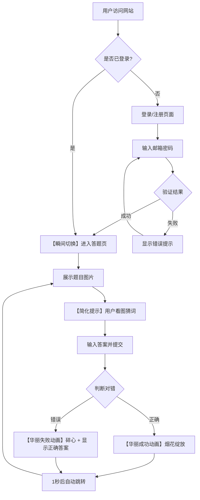

# 产品需求文档：看图猜词小游戏 - 体验优化 V2.0

## 文档信息

| 属性 | 值 |
|------|-----|
| 文档编号 | PRD-002 |
| 版本 | V2.0 |
| 创建日期 | 2026-02-02 |
| 关联文档 | PRD-001（基础功能版本） |
| 优化范围 | 前端交互体验 |
| 状态 | 待实现 |

---

## 1. 综述 (Overview)

### 1.1 项目背景与核心问题

本文档是对「看图猜词」小游戏的体验优化需求，基于 PRD-001 已实现的基础功能进行迭代。

**核心问题**：当前版本在用户体验方面存在以下痛点：
- 页面过渡不够流畅，登录到答题页的切换有视觉卡顿（双页面重叠）
- 答题页面提示信息冗余，同时存在步骤指示器、标签和文字提示
- 页面在100%缩放时需要滚动才能完成答题操作
- 答题结果反馈较为单调，缺乏情感化设计，且需手动点击下一题

**优化目标**：提升用户的整体答题体验，使流程更加流畅、界面更加简洁、反馈更加有趣。

### 1.2 核心业务流程 / 用户旅程地图

本次优化涉及两个阶段：

1. **阶段一：登录进入** - 优化页面切换体验，消除双页面重叠
2. **阶段二：答题核心循环** - 简化提示、优化布局、增加华丽动画反馈与自动跳转

```
┌─────────────────────────────────────────────────────────────────┐
│                     用户旅程地图（优化版）                        │
├─────────────────────────────────────────────────────────────────┤
│                                                                 │
│  阶段一：登录进入        阶段二：答题核心循环                      │
│  ┌──────────────┐      ┌─────────────────────────────────┐     │
│  │ 登录成功     │ ──→  │  看图 → 输入答案 → 提交 → 反馈   │     │
│  │ 【无缝切换】 │      │  【简化提示】【布局优化】        │     │
│  └──────────────┘      │  【华丽动画反馈】【自动跳转】    │     │
│                        └─────────────────────────────────┘     │
└─────────────────────────────────────────────────────────────────┘
```

### 1.3 Mermaid 图（流程/状态/时序）

#### 1.3.1 用户操作流（优化后）



**流程说明**：
- 【瞬间切换】：登录成功后无过渡直达答题页
- 【简化提示】：移除冗余提示，只保留步骤指示器
- 【华丽动画】：答题结果用视觉动画反馈，1秒后自动进入下一题

---

## 2. 用户故事详述 (User Stories)

### 阶段一：登录进入

---

#### **IMP-01: 作为刚登录成功的用户，我希望立即看到答题页面，不要有页面重叠的视觉干扰，以便获得流畅干净的页面切换体验。**

* **价值陈述 (Value Statement)**:
    * **作为** 刚登录成功的用户
    * **我希望** 登录后立即看到答题页面，不要有页面重叠的视觉干扰
    * **以便于** 获得流畅、干净的页面切换体验

* **业务规则与逻辑 (Business Logic)**:
    1. **前置条件**: 用户在登录页完成邮箱密码输入，点击登录按钮
    2. **操作流程 (Happy Path)**:
        - 用户点击登录/注册按钮
        - 系统验证成功
        - 登录页瞬间消失（无离场动画）
        - 答题页以轻微淡入效果出现（约0.15-0.2秒）
        - 整个过程中不会同时看到两个页面
    3. **异常处理 (Error Handling)**:
        - 登录失败时保持在登录页，显示错误提示，无页面切换

* **验收标准 (Acceptance Criteria)**:
    * **场景1: 登录成功页面切换**
        * **GIVEN** 用户在登录页输入正确的邮箱和密码
        * **WHEN** 点击登录按钮且验证成功
        * **THEN** 登录页立即消失，答题页以淡入效果出现，整个过程中不会同时看到两个页面

* **技术实现要点**:
    - 修改 `frontend/src/styles.css` 中的页面过渡动画
    - 登录页离场：`transition: none`（瞬间消失）
    - 答题页入场：`transition: opacity 0.15s ease`（轻微淡入）

---

### 阶段二：答题核心循环

---

#### **IMP-02: 作为答题中的用户，我希望页面提示简洁明了，不要重复冗余的引导信息，以便专注于看图和答题本身。**

* **价值陈述 (Value Statement)**:
    * **作为** 答题中的用户
    * **我希望** 页面提示简洁明了，不要重复冗余的引导信息
    * **以便于** 专注于看图和答题本身

* **业务规则与逻辑 (Business Logic)**:
    1. **前置条件**: 用户进入答题页面
    2. **操作流程 (Happy Path)**:
        - 页面只显示步骤指示器（① 看图 → ② 猜词 → ③ 提交）
        - 移除以下冗余元素：
          - 文字说明 "看图 → 输入词语 → 提交答案"
          - 标签 "题目图片"
          - hint "提示：仔细观察图片里的物体或动作"
    3. **异常处理 (Error Handling)**: 不适用

* **验收标准 (Acceptance Criteria)**:
    * **场景1: 简化后的页面提示**
        * **GIVEN** 用户进入答题页面
        * **WHEN** 页面加载完成
        * **THEN** 只显示步骤指示器（① 看图 → ② 猜词 → ③ 提交），无其他冗余提示文字

* **页面布局线框图 (ASCII Wireframe)**:
    ```text
    ┌─────────────────────────────────────────────────────┐
    │  [本局任务]  看图猜词                    [退出登录]  │
    ├─────────────────────────────────────────────────────┤
    │        ① 看图  →  ② 猜词  →  ③ 提交                │
    ├─────────────────────────────────────────────────────┤
    │  ┌─────────────────────────────────────┐            │
    │  │                                     │            │
    │  │            [题目图片]               │            │
    │  │                                     │            │
    │  └─────────────────────────────────────┘            │
    │                                                     │
    │  你的答案：[______________________________]         │
    │                                                     │
    │              [    提交答案    ]                     │
    └─────────────────────────────────────────────────────┘
    ```

* **技术实现要点**:
    - 修改 `frontend/src/pages/GamePage.vue`
    - 移除 `<p class="muted">看图 → 输入词语 → 提交答案</p>`
    - 移除 `<div class="label">题目图片</div>`
    - 移除 `<p class="muted hint">提示：仔细观察图片里的物体或动作。</p>`

---

#### **IMP-03: 作为答题中的用户，我希望在100%缩放下一屏内看到完整的题目图片、输入框和提交按钮，以便无需滚动即可完成答题操作。**

* **价值陈述 (Value Statement)**:
    * **作为** 答题中的用户
    * **我希望** 在100%缩放下，一屏内看到完整的题目图片、输入框和提交按钮
    * **以便于** 无需滚动即可完成答题操作

* **业务规则与逻辑 (Business Logic)**:
    1. **前置条件**: 用户使用 1920×1080 分辨率，浏览器100%缩放
    2. **操作流程 (Happy Path)**:
        - 页面采用横向并排布局
        - 左侧：题目图片区域（约50%宽度）
        - 右侧：答题区域（输入框 + 提交按钮）
        - 图片保持比例显示，不变形
    3. **异常处理 (Error Handling)**:
        - 小屏幕（如移动端）可回退为上下布局

* **验收标准 (Acceptance Criteria)**:
    * **场景1: 全高清无滚动体验**
        * **GIVEN** 用户使用 1920×1080 分辨率、浏览器100%缩放
        * **WHEN** 进入答题页面
        * **THEN** 无需滚动即可看到完整的步骤指示器、题目图片、输入框和提交按钮

* **页面布局线框图 (ASCII Wireframe)**:
    ```text
    ┌──────────────────────────────────────────────────────────────────┐
    │  [本局任务] 看图猜词                              [退出登录]     │
    ├──────────────────────────────────────────────────────────────────┤
    │                 ① 看图  →  ② 猜词  →  ③ 提交                    │
    ├─────────────────────────────────┬────────────────────────────────┤
    │                                 │                                │
    │    ┌───────────────────────┐    │      你的答案：                │
    │    │                       │    │                                │
    │    │                       │    │      [____________________]    │
    │    │      [题目图片]        │    │                                │
    │    │                       │    │                                │
    │    │                       │    │      [     提交答案     ]      │
    │    └───────────────────────┘    │                                │
    │                                 │                                │
    └─────────────────────────────────┴────────────────────────────────┘
    ```

* **技术实现要点**:
    - 修改 `frontend/src/pages/GamePage.vue` 模板结构
    - 修改 `frontend/src/styles.css` 添加横向布局样式
    - 使用 CSS Grid 或 Flexbox 实现左右并排
    - 图片区域与答题区域各占约50%宽度

---

#### **IMP-04: 作为答对题目的用户，我希望看到一个华丽开心的烟花动画反馈，然后自动跳转下一题，以便获得成就感和愉悦的游戏体验。**

* **价值陈述 (Value Statement)**:
    * **作为** 答对题目的用户
    * **我希望** 看到一个华丽、开心的烟花动画反馈，然后自动跳转下一题
    * **以便于** 获得成就感和愉悦的游戏体验

* **业务规则与逻辑 (Business Logic)**:
    1. **前置条件**: 用户已提交答案且答案正确
    2. **操作流程 (Happy Path)**:
        - 系统判定答案正确
        - 图片区域正中间绽放烟花动画
        - 同时显示"答对啦！"文字
        - 动画持续约1秒
        - 动画结束后自动加载并跳转到下一题
        - 无需用户手动点击"下一题"按钮
    3. **异常处理 (Error Handling)**:
        - 如果下一题加载失败，显示错误提示并允许重试

* **验收标准 (Acceptance Criteria)**:
    * **场景1: 答对后显示动画**
        * **GIVEN** 用户已输入正确答案
        * **WHEN** 点击提交按钮
        * **THEN** 图片区域正中间绽放烟花动画，同时显示"答对啦！"文字
    * **场景2: 自动跳转**
        * **GIVEN** 烟花动画正在播放
        * **WHEN** 动画播放约1秒后
        * **THEN** 动画消失，自动加载并显示下一题，无需用户点击

* **动画效果示意 (ASCII Wireframe)**:
    ```text
    ┌─────────────────────────────────┬────────────────────────────────┐
    │                                 │                                │
    │    ┌───────────────────────┐    │      你的答案：                │
    │    │      \   |   /        │    │                                │
    │    │    ── ✦ ✦ ✦ ──        │    │      [  苹果  ]               │
    │    │      / ✦|✦ \    🎆    │    │                                │
    │    │        ✦ ✦            │    │      答对啦！                  │
    │    │     [图片模糊]         │    │                                │
    │    └───────────────────────┘    │                                │
    │                                 │                                │
    └─────────────────────────────────┴────────────────────────────────┘

                        ↓ 1秒后自动跳转 ↓

    ┌─────────────────────────────────┬────────────────────────────────┐
    │    ┌───────────────────────┐    │      你的答案：                │
    │    │                       │    │      [____________________]    │
    │    │     [下一题图片]       │    │      [     提交答案     ]      │
    │    └───────────────────────┘    │                                │
    └─────────────────────────────────┴────────────────────────────────┘
    ```

* **技术实现要点**:
    - 修改 `frontend/src/pages/GamePage.vue` 添加动画组件和自动跳转逻辑
    - 修改 `frontend/src/styles.css` 添加烟花动画样式
    - 使用 CSS `@keyframes` 实现烟花绽放效果
    - 使用 `setTimeout` 实现1秒后自动调用 `nextQuestion()`

---

#### **IMP-05: 作为答错题目的用户，我希望看到一个华丽但带有遗憾感的碎心动画，并能看到正确答案，然后自动跳转下一题，以便知道自己错了并学习正确答案。**

* **价值陈述 (Value Statement)**:
    * **作为** 答错题目的用户
    * **我希望** 看到一个华丽但带有遗憾感的碎心动画，并能看到正确答案，然后自动跳转下一题
    * **以便于** 知道自己错了，同时学习正确答案

* **业务规则与逻辑 (Business Logic)**:
    1. **前置条件**: 用户已提交答案且答案错误
    2. **操作流程 (Happy Path)**:
        - 系统判定答案错误
        - 图片区域正中间显示碎心动画（心从中间碎开）
        - 同时显示"答错了～"文字和"正确答案：xxx"
        - 动画持续约1秒
        - 动画结束后自动加载并跳转到下一题
        - 无需用户手动点击"下一题"按钮
    3. **异常处理 (Error Handling)**:
        - 如果下一题加载失败，显示错误提示并允许重试

* **验收标准 (Acceptance Criteria)**:
    * **场景1: 答错后显示动画**
        * **GIVEN** 用户已输入错误答案
        * **WHEN** 点击提交按钮
        * **THEN** 图片区域正中间显示碎心动画，同时显示"答错了～"和"正确答案：xxx"
    * **场景2: 自动跳转**
        * **GIVEN** 碎心动画正在播放
        * **WHEN** 动画播放约1秒后
        * **THEN** 动画消失，自动加载并显示下一题，无需用户点击

* **动画效果示意 (ASCII Wireframe)**:
    ```text
    ┌─────────────────────────────────┬────────────────────────────────┐
    │                                 │                                │
    │    ┌───────────────────────┐    │      你的答案：                │
    │    │                       │    │                                │
    │    │      💔     💔        │    │      [  香蕉  ]               │
    │    │        ╲   ╱          │    │                                │
    │    │     (碎心效果)        │    │      答错了～                  │
    │    │                       │    │      正确答案：苹果            │
    │    │     [图片模糊]         │    │                                │
    │    └───────────────────────┘    │                                │
    │                                 │                                │
    └─────────────────────────────────┴────────────────────────────────┘

                        ↓ 1秒后自动跳转 ↓

    ┌─────────────────────────────────┬────────────────────────────────┐
    │    ┌───────────────────────┐    │      你的答案：                │
    │    │                       │    │      [____________________]    │
    │    │     [下一题图片]       │    │      [     提交答案     ]      │
    │    └───────────────────────┘    │                                │
    └─────────────────────────────────┴────────────────────────────────┘
    ```

* **技术实现要点**:
    - 修改 `frontend/src/pages/GamePage.vue` 添加动画组件和自动跳转逻辑
    - 修改 `frontend/src/styles.css` 添加碎心动画样式
    - 使用 CSS `@keyframes` 实现心碎裂效果
    - 使用 `setTimeout` 实现1秒后自动调用 `nextQuestion()`

---

## 3. 优先级与依赖关系

| 编号 | 优化项 | 优先级 | 依赖项 |
|------|--------|--------|--------|
| IMP-01 | 页面过渡优化 | P1 | 无 |
| IMP-02 | 简化答题提示 | P1 | 无 |
| IMP-03 | 页面布局优化 | P1 | IMP-02 |
| IMP-04 | 答对华丽动画 | P2 | IMP-03 |
| IMP-05 | 答错华丽动画 | P2 | IMP-03 |

---

## 4. 非功能性需求

### 4.1 性能要求
- 动画使用 CSS `transform` 和 `opacity` 实现，避免触发重排
- 动画元素数量控制在合理范围，避免性能问题
- 动画结束后及时清理 DOM 元素

### 4.2 兼容性要求
- 支持现代浏览器（Chrome 80+、Firefox 75+、Safari 13+、Edge 80+）
- 移动端需测试动画流畅度

### 4.3 可访问性要求
- 动画不应影响屏幕阅读器用户
- 考虑提供 `prefers-reduced-motion` 媒体查询支持，为不喜欢动画的用户提供替代方案

---

## 5. 涉及文件清单

| 文件路径 | 修改内容 |
|----------|----------|
| `frontend/src/styles.css` | 页面过渡动画、横向布局样式、烟花/碎心动画 |
| `frontend/src/pages/GamePage.vue` | 移除冗余提示、调整布局结构、添加动画组件和自动跳转逻辑 |
| `frontend/src/App.vue` | 可能需要调整 transition 配置 |

---

## 更新记录

| 日期 | 版本 | 描述 | 作者 |
|------|------|------|------|
| 2026-02-02 | V2.0 | 初始版本，包含5项体验优化需求 | - |
