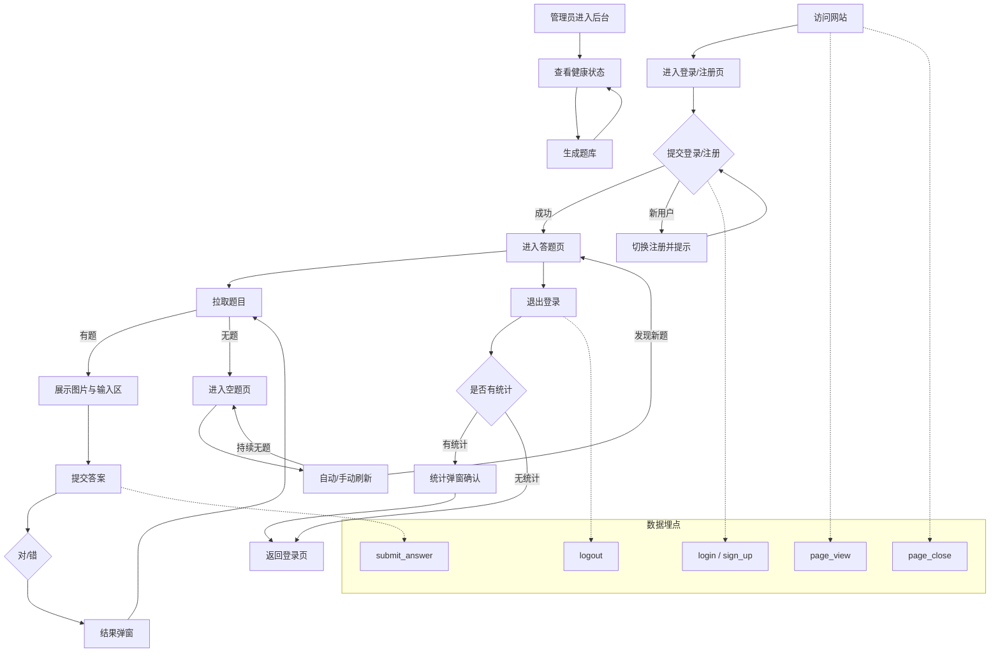
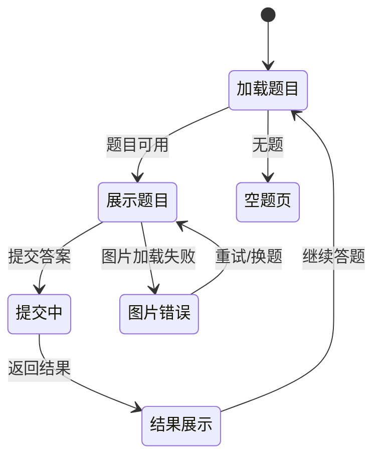
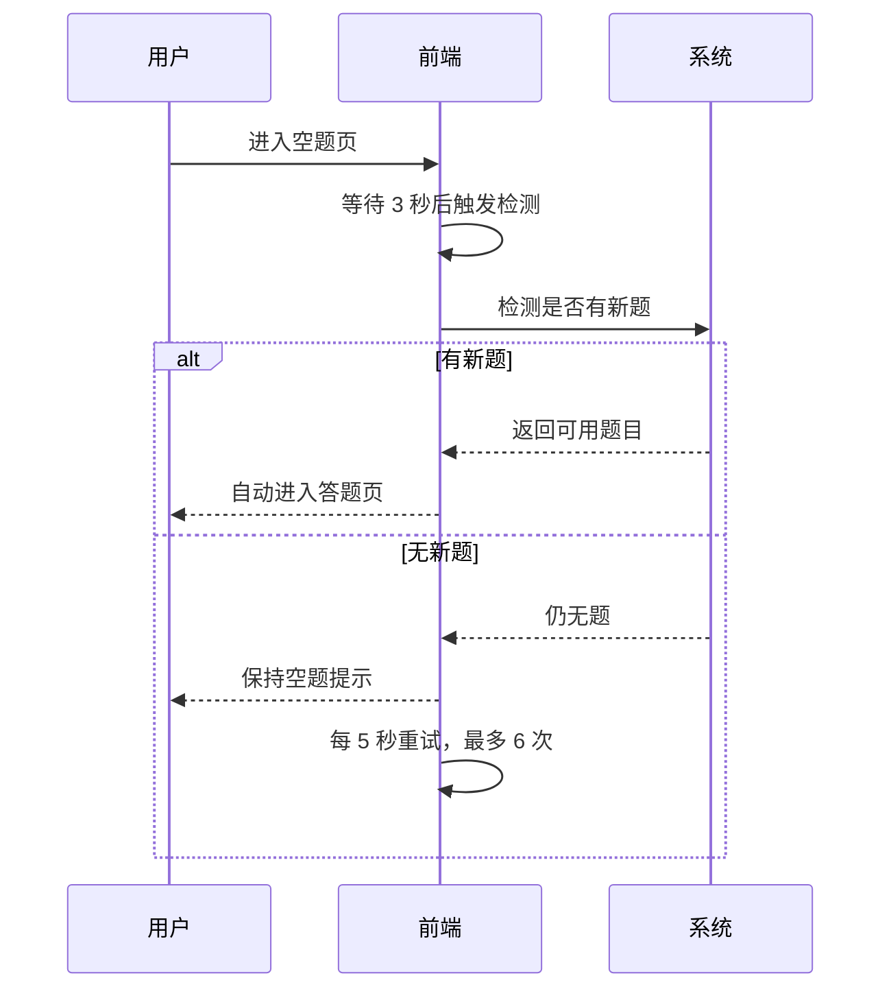

# 产品需求文档：看图猜词小游戏（已实现逻辑） - V3.0

## 1. 概述 (Overview)
### 1.1 项目背景与核心问题
本版本面向 Web 端已实现功能的统一梳理与对齐，覆盖登录/注册、答题主循环、空题处理、管理员后台与数据埋点。核心问题是确保用户流程完整可用、异常路径可恢复，并为运营提供稳定的行为数据采集。

### 1.2 核心业务流程 / 用户旅程地图
1.  **阶段一：访问与身份** - 访问站点并完成登录/注册进入答题
2.  **阶段二：答题主循环** - 拉题、看图、输入、提交、反馈、继续
3.  **阶段三：退出与总结** - 退出登录并确认统计结果（如有）
4.  **阶段四：空题处理** - 无题时提示与自动/手动重试
5.  **阶段五：管理员旅程** - 查看健康状态与生成题库
6.  **阶段六：数据埋点** - 记录关键行为事件以支持分析

### 1.3 Mermaid 图（流程/状态/时序）
> 说明：Mermaid 图用于“需求对齐”，避免歧义；不包含 API 路径、字段、HTTP code、框架细节。

#### 1.3.1 用户操作流（必填）


#### 1.3.2 状态机（当存在明确状态流转对象时必填）


#### 1.3.3 关键场景时序（仅当“时序/重试/超时”影响用户可见结果时填写）


## 2. 用户故事详述 (User Stories)

### 阶段一：访问与身份

---

#### **US-01: 作为访问者，我希望访问根路径时直接进入登录页，以便快速开始登录/注册**
*   **价值陈述 (Value Statement)**:
    *   **作为** 访问者
    *   **我希望** 访问站点即可进入登录页
    *   **以便于** 立即开始登录或注册
*   **业务规则与逻辑 (Business Logic)**:
    1.  **前置条件**: 用户访问站点根路径或进入需要鉴权的页面
    2.  **操作流程 (Happy Path)**:
        - 根路径自动跳转到登录页
        - 登录成功后进入答题页
        - 页面请求返回未登录时，自动跳转登录页
    3.  **异常处理 (Error Handling)**:
        - 无需额外处理，按默认路由处理
*   **验收标准 (Acceptance Criteria)**:
    *   **场景1: 根路径重定向**
        *   **GIVEN** 用户访问根路径
        *   **WHEN** 页面加载
        *   **THEN** 自动跳转到登录页
    *   **场景2: 未登录访问受限页**
        *   **GIVEN** 用户未登录
        *   **WHEN** 页面请求返回未登录
        *   **THEN** 自动跳转到登录页

---

#### **US-02: 作为新/老用户，我希望在同一页完成登录或注册，以便快速进入答题**
*   **价值陈述 (Value Statement)**:
    *   **作为** 新用户或老用户
    *   **我希望** 在同一页完成登录或注册
    *   **以便于** 快速进入答题流程
*   **业务规则与逻辑 (Business Logic)**:
    1.  **前置条件**: 用户进入登录/注册页
    2.  **操作流程 (Happy Path)**:
        - 用户输入邮箱与密码并提交
        - 登录成功进入答题页
        - 注册成功进入答题页
        - 登录用户不存在时切换注册模式并提示
    3.  **异常处理 (Error Handling)**:
        - 邮箱格式不合法提示错误
        - 密码长度不足提示错误
        - 注册确认密码不一致提示错误
        - 登录密码错误提示错误
        - 注册邮箱已存在提示并切回登录模式
*   **验收标准 (Acceptance Criteria)**:
    *   **场景1: 登录成功**
        *   **GIVEN** 用户输入合法邮箱与密码
        *   **WHEN** 提交登录
        *   **THEN** 进入答题页
    *   **场景2: 用户不存在**
        *   **GIVEN** 用户邮箱不存在
        *   **WHEN** 提交登录
        *   **THEN** 切换注册模式并提示
    *   **场景3: 注册成功**
        *   **GIVEN** 注册信息合法
        *   **WHEN** 提交注册
        *   **THEN** 进入答题页
    *   **场景4: 校验失败**
        *   **GIVEN** 邮箱无效或密码不足或确认不一致
        *   **WHEN** 提交
        *   **THEN** 显示错误提示且不提交
---
*   **页面布局线框图(ASCII Wireframe)**:
    ```text
    +--------------------------------------------------+
    |  [Pill] 开始答题                                 |
    |  标题：欢迎回来 / 新用户注册                       |
    |  副文案：输入邮箱和密码继续游戏 / 创建账号…        |
    |                                                  |
    |  邮箱: [___________________________]             |
    |  密码: [___________________________]             |
    |  (注册)确认密码: [___________________]            |
    |                                                  |
    |  (提示/错误信息区域)                              |
    |                                                  |
    |  [ ] 记住我                                       |
    |                                                  |
    |  [ 登录/注册 按钮 ] (loading 时显示处理中…)        |
    |                                                  |
    |  没有账号? 去注册 / 已有账号? 去登录               |
    +--------------------------------------------------+
    ```

### 阶段二：答题主循环

---

#### **US-03: 作为已登录用户，我希望进入答题页时自动拉取题目并展示图片与输入区，以便开始答题**
*   **价值陈述 (Value Statement)**:
    *   **作为** 已登录用户
    *   **我希望** 进入答题页后自动获取题目并展示
    *   **以便于** 立即开始答题
*   **业务规则与逻辑 (Business Logic)**:
    1.  **前置条件**: 用户已登录并进入答题页
    2.  **操作流程 (Happy Path)**:
        - 页面加载后拉取题目
        - 有题目时展示图片与输入区
        - 管理员显示“管理后台”入口按钮
    3.  **异常处理 (Error Handling)**:
        - 无题目时跳转空题页
        - 未登录时返回登录页
        - 图片加载失败提供重试与换题
        - 拉题失败显示错误提示
*   **验收标准 (Acceptance Criteria)**:
    *   **场景1: 拉题成功**
        *   **GIVEN** 用户进入答题页
        *   **WHEN** 题目加载完成
        *   **THEN** 显示图片与答题输入区
    *   **场景2: 无题目**
        *   **GIVEN** 题库为空
        *   **WHEN** 拉题完成
        *   **THEN** 跳转空题页
    *   **场景3: 图片加载失败**
        *   **GIVEN** 图片加载失败
        *   **WHEN** 显示错误
        *   **THEN** 可选择重试或换题
---
*   **页面布局线框图(ASCII Wireframe)**:
    ```text
    +--------------------------------------------------------------+
    |  [Admin] [Logout]                                            |
    +--------------------------------------------------------------+
    |  [ Image Area / Loading / Error ]                            |
    |                                                              |
    |  (image error)  Retry  |  Next                               |
    +--------------------------------------------------------------+
    |  Your Answer: [_______________________________]              |
    |  (input error text)                                          |
    |                                                              |
    |  [ Submit Answer ]                                           |
    +--------------------------------------------------------------+
    ```

---

#### **US-04: 作为答题用户，我希望提交答案后立即看到对/错结果，并可继续答题**
*   **价值陈述 (Value Statement)**:
    *   **作为** 答题用户
    *   **我希望** 提交答案后看到结果反馈
    *   **以便于** 继续下一题
*   **业务规则与逻辑 (Business Logic)**:
    1.  **前置条件**: 题目已展示
    2.  **操作流程 (Happy Path)**:
        - 输入答案并提交
        - 展示结果弹窗
        - 点击继续答题加载下一题
    3.  **异常处理 (Error Handling)**:
        - 空答案提示错误并阻止提交
        - 提交失败显示错误提示
*   **验收标准 (Acceptance Criteria)**:
    *   **场景1: 正常提交**
        *   **GIVEN** 已输入答案
        *   **WHEN** 点击提交
        *   **THEN** 显示结果弹窗
    *   **场景2: 答案错误**
        *   **GIVEN** 返回结果为错误
        *   **WHEN** 弹窗展示
        *   **THEN** 显示正确答案
    *   **场景3: 继续答题**
        *   **GIVEN** 结果弹窗已展示
        *   **WHEN** 点击继续答题
        *   **THEN** 加载下一题
---
*   **页面布局线框图(ASCII Wireframe)**:
    ```text
    +-----------------------------+
    |  [结果标题]                 |
    |  (错误时) 正确答案：xxx      |
    |                             |
    |  [ 继续答题 ]               |
    +-----------------------------+
    ```

### 阶段三：退出与总结

---

#### **US-05: 作为答题用户，我希望退出登录时看到本次统计（如有），然后确认退出**
*   **价值陈述 (Value Statement)**:
    *   **作为** 答题用户
    *   **我希望** 退出时查看统计并确认
    *   **以便于** 了解本次表现
*   **业务规则与逻辑 (Business Logic)**:
    1.  **前置条件**: 用户在答题页
    2.  **操作流程 (Happy Path)**:
        - 点击退出触发退出流程
        - 若存在统计则展示弹窗
        - 确认后返回登录页
        - 无统计时直接返回登录页
    3.  **异常处理 (Error Handling)**:
        - 退出失败显示错误提示并停留当前页
*   **验收标准 (Acceptance Criteria)**:
    *   **场景1: 有统计**
        *   **GIVEN** 退出返回统计
        *   **WHEN** 弹窗展示
        *   **THEN** 确认后返回登录页
    *   **场景2: 无统计**
        *   **GIVEN** 退出未返回统计
        *   **WHEN** 退出完成
        *   **THEN** 直接返回登录页
---
*   **页面布局线框图(ASCII Wireframe)**:
    ```text
    +-----------------------------+
    |  本次答题统计               |
    |  ✅ 答对：xx 题             |
    |  ❌ 答错：xx 题             |
    |  🎯 正确率：xx%             |
    |                             |
    |  [ 确认退出 ]               |
    +-----------------------------+
    ```

### 阶段四：空题处理

---

#### **US-06: 作为答题用户，当题库为空时我希望自动/手动刷新，以便尽快继续答题**
*   **价值陈述 (Value Statement)**:
    *   **作为** 答题用户
    *   **我希望** 题库为空时能自动/手动刷新
    *   **以便于** 尽快继续答题
*   **业务规则与逻辑 (Business Logic)**:
    1.  **前置条件**: 题库为空进入空题页
    2.  **操作流程 (Happy Path)**:
        - 进入后 3 秒触发首次检测
        - 每 5 秒重试一次，最多 6 次
        - 手动点击“刷新看看”立即检测
        - 发现新题后自动进入答题页
    3.  **异常处理 (Error Handling)**:
        - 检测失败忽略错误并继续重试
        - 点击返回登录会执行退出并跳转登录页
*   **验收标准 (Acceptance Criteria)**:
    *   **场景1: 自动重试**
        *   **GIVEN** 进入空题页
        *   **WHEN** 超过 3 秒
        *   **THEN** 自动触发检测并按 5 秒节奏重试
    *   **场景2: 手动刷新**
        *   **GIVEN** 用户点击刷新
        *   **WHEN** 检测到新题
        *   **THEN** 自动进入答题页
---
*   **页面布局线框图(ASCII Wireframe)**:
    ```text
    +-------------------------------------------+
    |  (emoji) 你真是个答题小天才！             |
    |  文案：题库正在更新中 / 题库补充中…         |
    |                                           |
    |  [ 刷新看看 ]  [ Admin ]  [ 返回登录页 ]   |
    +-------------------------------------------+
    ```

### 阶段五：管理员旅程

---

#### **US-07: 作为管理员，我希望查看健康状态并生成题库，以便维护题库可用性**
*   **价值陈述 (Value Statement)**:
    *   **作为** 管理员
    *   **我希望** 查看健康状态并生成题库
    *   **以便于** 维护题库可用性
*   **业务规则与逻辑 (Business Logic)**:
    1.  **前置条件**: 管理员进入后台页面
    2.  **操作流程 (Happy Path)**:
        - 展示健康状态与统计信息
        - 生成题库数量范围 1-20
        - 生成成功后显示结果并刷新统计
    3.  **异常处理 (Error Handling)**:
        - 未登录跳转登录
        - 非管理员提示无权限
        - 生成失败显示错误提示
*   **验收标准 (Acceptance Criteria)**:
    *   **场景1: 健康信息展示**
        *   **GIVEN** 管理员进入后台
        *   **WHEN** 页面加载
        *   **THEN** 展示健康状态与统计信息
    *   **场景2: 生成成功**
        *   **GIVEN** 输入合法生成数量
        *   **WHEN** 提交生成
        *   **THEN** 显示生成结果并刷新统计
    *   **场景3: 无权限访问**
        *   **GIVEN** 非管理员访问
        *   **WHEN** 权限校验失败
        *   **THEN** 显示无权限提示
---
*   **页面布局线框图(ASCII Wireframe)**:
    ```text
    +-------------------------------------------+
    |  Admin                                    |
    |  服务状态: 正常/异常                       |
    |  题目数量: xx                             |
    |  用户数量: xx                             |
    |  答题数量: xx                             |
    |  环境: prod/dev                           |
    |  更新时间: xxxx                           |
    |                                           |
    |  生成题量: [ 5 ] (1-20)                   |
    |  [ 生成题目 ]   [ 刷新状态 ]              |
    |                                           |
    |  (结果提示) 本次请求/生成/入库             |
    +-------------------------------------------+
    ```

### 阶段六：数据埋点

---

#### **US-08: 作为运营/数据分析人员，我希望系统记录关键行为事件，以便评估转化与使用情况**
*   **价值陈述 (Value Statement)**:
    *   **作为** 运营/数据分析人员
    *   **我希望** 记录关键行为事件
    *   **以便于** 评估转化与使用情况
*   **业务规则与逻辑 (Business Logic)**:
    1.  **前置条件**: 配置 GA4 Measurement ID
    2.  **操作流程 (Happy Path)**:
        - 页面访问记录 page_view
        - 登录成功记录 login
        - 注册成功记录 sign_up
        - 提交答案记录 submit_answer
        - 退出登录记录 logout
        - 页面关闭记录 page_close
    3.  **异常处理 (Error Handling)**:
        - 未配置 Measurement ID 时不发送事件
        - 不采集邮箱、密码等敏感信息
*   **验收标准 (Acceptance Criteria)**:
    *   **场景1: 配置已开启**
        *   **GIVEN** 已配置 Measurement ID
        *   **WHEN** 发生关键行为
        *   **THEN** 发送对应事件
    *   **场景2: 配置未开启**
        *   **GIVEN** 未配置 Measurement ID
        *   **WHEN** 发生关键行为
        *   **THEN** 不发送任何事件
